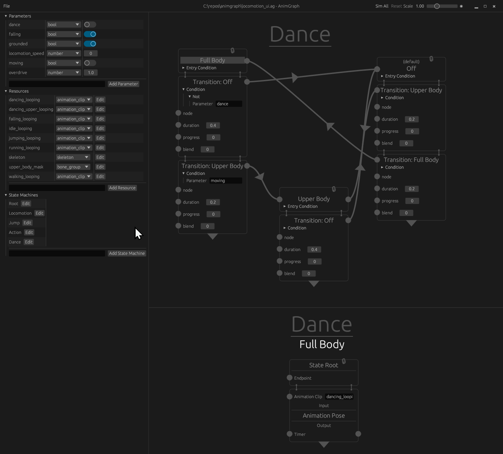

# Animgraph 

## What is Animgraph?

Animgraph is a data flow library using hierarchical state machines written in Rust for animation. It provides a set of features including a data model, compiler, and interpreter to evaluate animation logic graphs and generate animation blend trees. The library supports parallel workflows, allowing developers to create and compose multiple graphs to create complex animation systems.

Key Features:
* Built-in support for conditional expressions, arithmetic operations, state machines, and transitions
* Default linear transition behavior that can be customized by connecting to the graph
* Extensibility through custom resources and nodes
* Runtime resource selection per graph (e.g., animation, bone groups, skeleton)
* Selection of available nodes at compile-time and runtime
* Serialization support for the data model and compiled runtime definition
* Lightweight runtime with the option to include the compiler
* Ability to compose multiple graphs for parallel workflows
* Various parameter types (boolean, number, vector, event, resource)
* Event system for communication between gameplay code and graphs, as well as between graphs
* Simple but effective debug triggers

## Demo: Ragtime Chairs

Demo available at [https://github.com/animgraph/ragtime_chairs](https://github.com/animgraph/ragtime_chairs) created with [Ambient](http://ambient.run).

## Prototype UI

The prototype UI for Animgraph was developed using [egui](https://github.com/emilk/egui), and is not included as part of Animgraph itself. Its main objective is to provide a glimpse of the desired user experience.

## WARNING: Early development

This library is in early development.

## Docs

Documentation is currently missing. See examples meanwhile.

## Examples

* `cargo run --example compiler_global`: The [compiler global example](examples/compiler_global.rs) is a simple graph showing customizable compiler global numbers
* `cargo run --example third_person`: The [third person example](examples/third_person.rs) produces the data model and compiled graph used in [ragtime_chairs](https://github.com/animgraph/ragtime_chairs)

## License

All code in this repository is dual-licensed under either:
* MIT License [LICENSE-MIT](./LICENSE-MIT)
* Apache License, Version 2.0 [LICENSE-APACHE](./LICENSE-APACHE)

## Contribution

Unless you explicitly state otherwise, any contribution intentionally submitted for inclusion in the work by you, as defined in the Apache-2.0 license, shall be dual licensed as above, without any additional terms or conditions.